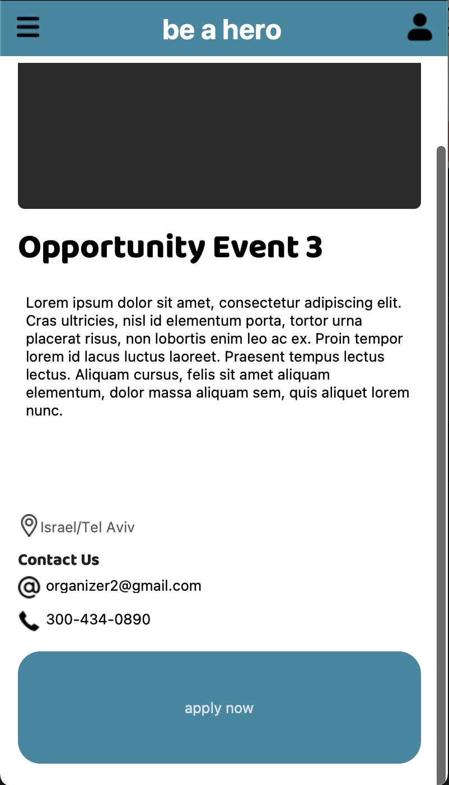

# HERO Application

**This app is build by using Python Custom Tkinter Library**

**Image Credits**

- [Menu Icon](https://www.flaticon.com/authors/bsd)
- [Open Card Icon](https://www.flaticon.com/authors/iconkanan)
- [User Profile Icon](https://www.flaticon.com/authors/saepul-nahwan)
- [Location Pin Icon](https://www.flaticon.com/authors/freepik)
- [Email Icon](https://www.flaticon.com/authors/ilham-fitrotul-hayat)
- [Phone Icon](https://www.flaticon.com/authors/ilham-fitrotul-hayat)
- [Left Arrow Icon](https://www.flaticon.com/authors/vectaicon)
- [Edit Icon](https://www.flaticon.com/authors/freepik)
- [Time Icon](https://www.flaticon.com/authors/dmitri13)
- [Checkmark Icon](https://www.flaticon.com/authors/pixel-perfect)

---
**Authors**

Lead - Alexi Gadish

Backend - Yurii Hriaziev www.linkedin.com/in/yurii-hriaziev-7aa875240

Frontend - Andressa Cicotoste www.linkedin.com/in/andressa-cicotoste-195230282/

---

**March 29, 2024, App**

      

